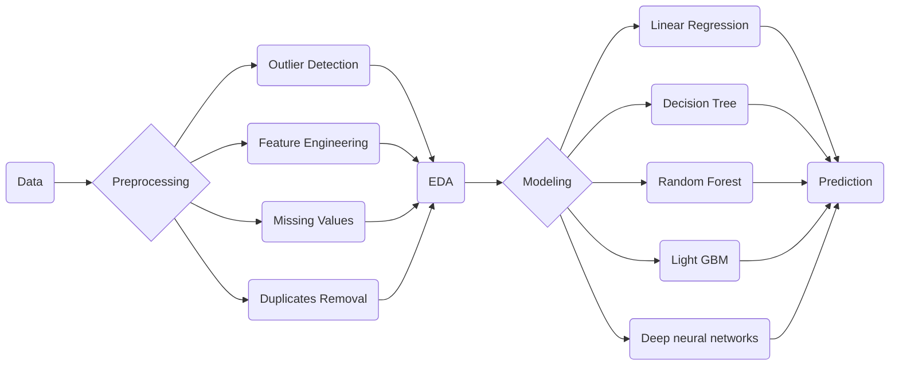

# TrueCar Used Car Price Predictions:

## Problem Statement:

It's very important for both the buyer and the seller of an used car to know what is the real price of the car, for the seller it's important to know the predicted price of the car to know how to but a competitive price for it.
 for the buyer the most important thing is to go through prices and know which car price is suitable for that car, and to know when the seller has estimated the car price.
 So in this project we used a data set from TrueCar.com and tried to know about it's predicted price using several techniques.
 

## Table of content:

- <a href="#data">Data set description.</a>
- <a href="#feature">Feature engineering.</a>
- <a href="#EDA">Exploratory data analysis.</a>
- <a href="#model">Modelling.</a>
- <a href="#dep">Deployment.</a>
- <a href="#fut">Future work.</a>

## Data set description:

Our Data is a scraped data from TrueCar.com that contains a several information about cars' offerings and the scraped features are as follows:
- Year when the car was manufactured. (Time)
- Model of the Car. (String)
- Brand of the car. (String)
- Price of the car. (Float)
- Vehicle Identity number AKA VIN. (String)
- Mileage of the car.(Float) 
- City of the seller of the car.
- State of the seller of the car.

## Feature Engineering:

In this part we saw that there are some potential feature engineering work that can help in the modelling process, like adding  some features and make some transformation on the data to be more insightful, and these features are:
- <b>Usage level:</b> of the car, and this depends on the Mileage made by the car, we divided the cars into 3 main categories.
- <b>City Importance:</b> it's known that in the highly populated cities it has some more prices, so we divided the cities into three main categories according to population obtained from the USA population site.
- <b>State Importance:</b> Same logic as the previous one but for states.
- <b>Model Level:</b> For the same brand it's known that it has some classes for the cars, and according to this we divided the cars into through categories according to the mean price for the car model in the data.
- <b>Model Popularity:</b> The popularity of the car manufacturer may affects the prices of the car, so we divided the car into 3 main categories according to the statistics about the brand from some website.

## Exploratory Data Analysis:

After feature engineering, we went through the data to answer some questions and found an interesting insights.

First of all, most of the cars that was offered was between 1995 and 2018 and the major percentage is between 2006 and 2018, according to that we divided the data set into to main categories that exhibit different behavior as we will describe in the next lines, one part is the old <b>Old cars </b>  (those cars were manufactured before 2006) and the other part is <b>New Cars</b> (those was manufactured between 2006-2018).

After that we noticed some outliers in the columns of the price and the mileage which can hurt the modeling, so we removed outliers that was beyond the 99th percentile of both.

We also found that, It Appears that the `Houston` City has the most offerings all the time, but Cities like `SAN ANTONIO` and `LOUISVILLE` has more new cars' offerings than the old cars' and cities like `SACRAMENTO`, `RALEIGH` and `CHANTILLY` has more older cars, so if yo want to by a relatively new car you can search in `Houston`, `SAN ANTONIO` and `LOUISVILLE` cities.

 

  
 

 

  
 

Morever, It Seams that `California`, `Texas` and `Florida` state has more offerings all the time, but other cities' may differ so if you want to buy a relatively new cars, it's supposed that you won't go to any of these cities but you can go to `Georgia` and `Illinois` States, but if you are not sure about the car it will be a good idea to go to on of the first three states as they have more offerings.

 

  
 

 

  
 

And Yes, the new cars have more than 2.5X the old car prices on average.

But <b>how can we represent the effect of the Place on the prices in both new and old cars?</b>

 

  
 

 

  
 

-   `Wyoming`,  `South Dakota`  have a relatively high prices over cars but it seams that it has not any offerings after 2017.
-   we can see an interesting behavior of  `Texas`  state, where the older cars has relatively small prices but for most recent cars  `2018`  it has the largest price.
-   finally the prices of the car have been doubled 4 times if it has has been manufactured recently.
- In the older cars there is a relatively constant prices for the cars.
-   For  `Rhode Island`  and  `West Virginia`  there are no offerings before  `1999`.

<b>what about the mileage and how can it behaves?</b>

 

  
 

 

  
 

-   For Old Cars it appears that there are relatively small decreasing trend in the Usage.
-   The  `Rhode Island`  State has the lower mileage for older cars, so if you want to buy an old car bu not used very much you can search in this state.
- For new cars, as expected the there is high decreasing trend in the usage compared to older ones, and there is no big difference in the usage across these states.

One more interesting thing is the <b>brand distribution of the car band on both types </b>, and when we study it we found:

 

  
 

 

  
 

- For New Cars, it appears that  `FORD`,  `CHEVROLET`,  `TOYOTA`  and  `NISSAN`  occupies more than have the distribution of the most frequent brands.
- For older cars, also  `FORD`,  `CHEVROLET`  and  `TOYOTA`  are old brands that are well established, but  `NISSAN`  Was a relatively new one, and  `HONDA`  took its place.
-   Also Here we can see that there are brands that was not in the new distribution, like  `MERCEDES-BENZ`  which may have two different meanings, the first is that:
    -   `MERCEDES-BENZ`  cars' are very good cars so their buyers of the new models are very loyal to them so they won't sell it.
    -   `MERCEDES-BENZ`  brand has been died in the new era, and this is not applicable.

lets ask another question, <b>how the Price of a certain brand cars' changes according the year of manufacturing?</b>
For New Cars:

 

  
 

 

  
 

- it seams that  `GMC`  brand has he highest prices among different ages of cars.
-   For  `JEEP`  Brand it seams that the newer cars doesn't have the same value of the older one, it seams it's decreasing compared to the other brands.

For Old Cars: 
- `HONDA`  is the lowest prices among all ages.
-   `DODGE`  Cars' prices has a increasing trend among all ages of the cars.
-   `GMC`  saves its place also in the old cars market.
 
<b>Is there is any relationship between Mileage, Year and Price?</b>

 

  
 

 

  
 

For New Cars:
- it appears that the price has a positive correlation between the price and the year of manufacturing and this means that as we saw before, newer cars has higher prices.
-   The Mileage here has a negative correlation with the Price which means that if the car has been used very much then this will affect its price negatively.
-   The relation between Year and Mileage has a negative correlation, so newer cars used less than the older one and this is the expected behavior.

For old cars
- The negative correlation of the mileage with the price is the same.
- But here the affect of the Year is very small (<1%) so it is so effective.

## Modeling:

In the modeling part we have applied several approaches depending on statistical machine learning and also deep learning approach, so we used:
- Linear Regression.
- Decision Tree.
- Random Forest.
- LightGBM.
- Deep neural network.

and we got an NRMSE values ranges from 0.02 (Random Forest) to 0.3, and also and R2 score from 0.6 to 0.85(LightGBM).

## Deployment:

To deploy this model we have used <b>Flask</b> Library and deployed a simple app using <b>Heroku</b>m and we can find the deployment from this link:
https://teamapredictions.herokuapp.com/

## Future Work:

> We are planning to enhance the models more and more, enhance the visual appearance of the deployment, experiment with different added features and make feature selection.

## Contributors:
- [Palak Agrawal](https://github.com/Palak-Agrawal28).
- [Harsh Agrawal](https://github.com/Harshcode20).
- Vansh Tayel.
- <a href = "https://github.com/shailja-singh" >Shailja Sengar. </a>
- <a href = "https://github.com/TarekMohamed1999/" >Tarek Mohamed. [Team Leader] </a>

Under mentorship of :
- <a href = "https://github.com/uttej2001" >Uttej Kumar</a>
